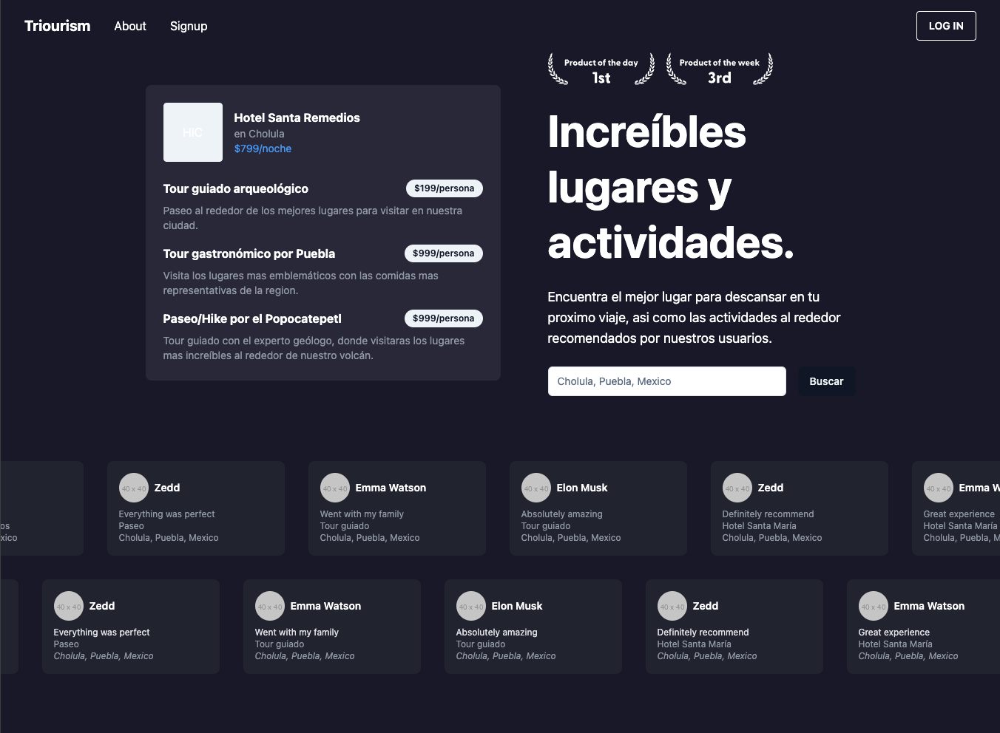
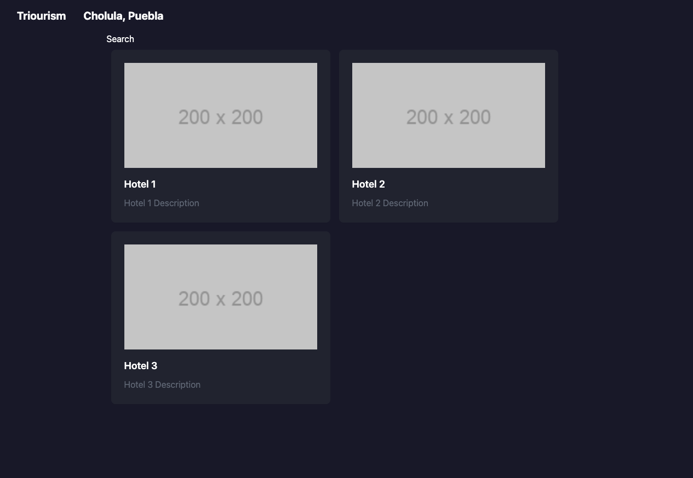

# Triourism

[](https://choosealicense.com/licenses/mit/)
[](https://opensource.org/licenses/)
[](http://www.gnu.org/licenses/agpl-3.0)

Find the best places to stay or activities to do for your next trip that accepts payments in ckBtc.

## Demo screenshots





## Acknowledgments

This project it's a starter for an MVP of using:

- Node Express API server with Azle for the backend.
- NextJs for the frontend.
- Payments should be done using ckBTC, ckETH or ICP.
- Identity or user auth should use II.

More on:

- [Azle Book](https://demergent-labs.github.io/azle/the_azle_book.html)
- [Internet Computer](https://internetcomputer.org/)
- [Internet Identity](https://internetcomputer.org/docs/current/developer-docs/integrations/internet-identity/overview)
- [Node Express](https://expressjs.com/)
- [Chain-Key Bitcoin](https://internetcomputer.org/docs/current/developer-docs/integrations/bitcoin/ckbtc)

## Authors

- [@bundlydev](https://www.github.com/bundlydev)
- [@alannnc](https://www.github.com/alannnc)
- [@adrian-d-hidalgo](https://github.com/adrian-d-hidalgo)

## Features

- NextJs
- Express Node
- ckBTC
- Internet Identity

## Roadmap

- Implement Internet Identity
- Use SQlite with prisma for all DB transactions
- Implement more payment methods such as ICP or ckETH

## Run Locally

Clone the project

```bash
  git clone https://github.com/bundlydev/triourism
```

Go to the project directory

```bash
  cd triourism
```

Install dependencies

```bash
  npm install
```

**only for mac**

```
codesign -s - .bitcoin/bin/bitcoind
```

```
npm install
npm run btc:start
```

In another terminal run:

```
npm run icp:start
```

Open another terminal and run:

```
npm run icp:deploy
```

or

```
npm run icp:deploy:local
```

# How to mint ckBTC

Instructions to mint to a principalId

- **codesign only for mac**

```
codesign -s - .bitcoin/bin/bitcoin-cli
```

```bash
npm run btc:mint --address=$ADDRESS
# Sometimes you have to wait a few seconds
dfx canister call wallet updateBalance
```
